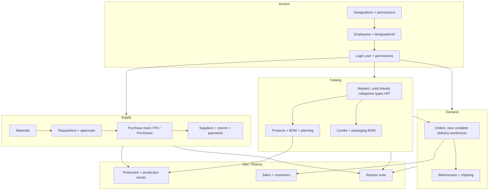

# Amzad Food Admin — Project Flow & Architecture Report

**Product:** ERP Admin Panel (`erp-amzadfood` v2.0.2)  
**Purpose:** Internal operations for Amzad Food — orders, inventory, production, purchases, CRM-style sales, content for the public site, and analytics reports.  
**Audience:** Developers and technical stakeholders who need to understand *how the app runs end-to-end*, not every line of UI code.

> **শুরু এখানে (সুন্দর ফ্লো, ডায়াগ্রাম সহ):** প্রথমে পড়ুন [**PROJECT_FLOW_VISUAL_GUIDE.md**](./PROJECT_FLOW_VISUAL_GUIDE.md) — সেখানে ৩টা Mermaid চিত্র + সংক্ষিপ্ত বাংলা ব্যাখ্যা + এই ফাইলের §12 / §15 / §17 লিঙ্ক। তারপর নিচের ধারাবাহিক সেকশনগুলোতে গভীরে নামুন।

---

## 1. What this application is (in one paragraph)

Staff log in through a **React** single-page app. The browser keeps an **auth token** (Redux + `redux-persist` + `localStorage`). Almost every screen lives under a **main layout** with a **sidebar** and **header**. Business data is loaded from a **REST-style backend** using **Redux Toolkit Query (RTK Query)** through a single **`baseApi`** instance. Access to routes and menu items is controlled by **role** (`ADMIN`) and **per-module permissions** tied to the user’s **designation**. For **designation → employee → catalog → materials → purchase → order → production → sales → reports** as one story, read **§12** below (not only the route table in §7). For **A→Z one-pass “whole project বুঝ”**, read **§17** at the end of this file. For **diagrams + short “কেমনে কী হচ্ছে” in Bangla first**, open **[PROJECT_FLOW_VISUAL_GUIDE.md](./PROJECT_FLOW_VISUAL_GUIDE.md)** first.

---

## 2. Technology stack

| Layer | Choice |
|--------|--------|
| UI | React 18, TypeScript, Vite |
| Styling | Tailwind CSS v4, Ant Design (antd) |
| Routing | React Router v6 (`createBrowserRouter`) |
| Global state / server cache | Redux Toolkit, RTK Query |
| Persistence | `redux-persist` (auth token, cart-related slices) |
| Maps / charts | `react-simple-maps`, ApexCharts, etc. (where used) |
| HTTP | `fetch` via RTK Query `fetchBaseQuery` |

---

## 3. How the app starts (live flow from blank tab)

1. **`index.html`** loads **`src/main.tsx`**.
2. **`main.tsx`** wraps the tree with:
   - **Ant Design `ConfigProvider`** (primary green `#019532`)
   - **`HelmetProvider`** (document titles)
   - **Redux `Provider`** + **`PersistGate`** (wait for rehydrated auth before relying on token)
   - **`ToastContainer`** (global notifications)
   - **`RouterProvider`** with the router from **`src/routes/routes.tsx`**
3. Several API slice modules are **imported for side effects** so their endpoints register with `baseApi` on startup.
4. **`initializeSampleData()`** from mock/local utilities may seed local data where applicable.

At this point the user either sees **`/login`** or, if a valid session exists, the **protected shell** at **`/`** with **`MainLayout`**.

```mermaid
flowchart LR
  subgraph boot [Bootstrap]
    A[main.tsx] --> B[Redux Store + Persist]
    B --> C[RouterProvider]
  end
  subgraph auth [Auth gate]
    C --> D{Token + user?}
    D -->|No| E[/login]
    D -->|Yes| F[MainLayout]
  end
  F --> G[Sidebar + Header + Outlet]
  G --> H[Page components]
  H --> I[RTK Query hooks]
  I --> J[(Backend API)]
```

---

## 4. Configuration (where “the server” is defined)

**File:** `src/config/index.ts`

| Variable | Role |
|----------|------|
| `VITE_PUBLIC_API_URL` | Base URL for all RTK Query requests (`baseApi`) |
| `VITE_PUBLIC_SERVER_URL` | Server root (when needed outside API paths) |
| `VITE_PUBLIC_IMAGE_ACCESS_URL` | Public URL prefix for media/images |
| `VITE_PUBLIC_APP_DOMAIN` | App domain context |
| `VITE_PUBLIC_TRACKING_URL` | Tracking integration |
| `VITE_PUBLIC_TINY_API_KEY` | TinyMCE (rich text) |

**Build / run:** `npm run dev` (Vite, default port **4099** in `package.json`), `npm run build` (`tsc -b && vite build`), `npm run lint`.

---

## 5. Authentication & HTTP layer

### 5.1 Auth slice

**Files:** `src/redux/features/auth/authSlice.ts`, `src/redux/features/auth/authApi.ts`

- Login stores **user** and **token** in Redux; token is also expected in **`localStorage`** as `"token"` (see `ProtectedRoute` and logout in **`Sidebar.tsx`**).
- Logout clears Redux and removes `localStorage` token, then navigates to **`/login`**.

### 5.2 `baseApi` — all APIs share one client

**File:** `src/redux/api/baseApi.ts`

- **`prepareHeaders`:** attaches `Authorization: Bearer <token>` from Redux state.
- **Client metadata:** builds JSON with IP (via `api.ipify.org`), user agent, current URL, timestamp → header **`X-Client-Details`**; also **`X-Action`** (endpoint name) for auditing/debug on the server.
- **Token refresh / 401 handling:** custom `baseQueryWithRefreshToken` wraps the raw query (see file for refresh logic and global `logout` on hard failure).
- **Toast errors:** failed mutations/queries can surface via `react-toastify` (configured in `main.tsx`).

Feature domains implement **`injectEndpoints`** into this same `baseApi` (see `src/redux/features/*/*Api.ts`).

---

## 6. Authorization — how “who can see what” works

Two complementary mechanisms exist:

### 6.1 Route-level: `ProtectedRoute` + `routePermissions`

**Files:** `src/routes/ProtectedRoute.tsx`, `src/routes/routes.tsx`

- Most authenticated routes use **`<ProtectedRoute roles={["ADMIN"]} employeePermissions={{ module, action }}>`** via helper **`protectRoute(path, element)`**.
- **`routePermissions`** is a map: **`pathname` → `{ module, action }`**. The path string must match how React Router resolves the URL (e.g. `/orders/:id` is registered as a pattern; dynamic segments use param names in the config).
- If the user has **no token**, **no user object**, or **fails** `module`/`action` check → redirect to **`/login`** or **`/404`** (silent “no access” is a common cause of “order details goes to 404” when permission names don’t match).

### 6.2 Menu-level: `useFilteredSidebarItems`

**Files:** `src/hooks/useFilteredSidebarItems.ts`, `src/components/common/Layouts/Sidebar.tsx`

- Sidebar nav is declared in **`SidebarItems`** (static tree with `path` / `subItems`).
- **`useFilteredSidebarItems`** filters items using the same **designation permissions** model so users only see modules they can open.
- **`useRoutePermission`** in **`MainLayout`** runs on route changes to align runtime checks with navigation.

**Mental model:** *Route permissions* guard direct URL entry; *sidebar filter* guards discoverability. Both should stay in sync with backend permission names.

---

## 7. Routing & screen map (by business area)

**Router definition:** `src/routes/routes.tsx`  
**Layout shell:** `/` → `ProtectedRoute` → **`MainLayout`** (`SidebarProvider` + `Sidebar` + `Header` + **`<Outlet />`**).

Below, paths are **representative**; the source of truth is always `routes.tsx` + `routePermissions`.

| Area | Example paths | Typical pages under `src/pages/` |
|------|----------------|-----------------------------------|
| Dashboard | `/` | `Dashboard/` |
| Auth (no layout) | `/login`, `/forgot-password`, `/reset-password` | `Auth/` |
| User / HR | `/designations`, `/employees` | `Designation/`, `Employees/` |
| Orders | `/orders/create`, `/orders/complete`, `/orders/:id`, `/orders/delivery`, `/orders/warehouse`, `/orders/search`, incomplete variants | `OrderManagement/` |
| Products | `/products`, `/product/:id`, `/create-product`, combo product routes, addons, reviews | `Product/`, `ComboProduct/`, `AddonList/`, `Reviews/` |
| Catalog / masters | `/units`, `/brands`, `/product-categories`, `/product-types`, `/addons` | `Units/`, `Brands/`, `ProductCategory/`, `ProductType/` |
| Materials & procurement | `/materials`, `/requisitions`, `/categories` (material), `/stock-alert`, `/purchase-need`, `/purchases`, `/purchase-returns`, `/suppliers` | `Materials/`, `RequisitionList/`, `PurchaseManagement/`, `Supplier/` |
| Production | `/productions`, `/production-stocks` | `Production/` |
| Sales / CRM | `/sales`, `/customer` | `SalesManagement/`, `Customers/` |
| Warehouses & VAT | `/warehouses`, `/warehouses/:id`, `/vat-settings` | `warehouse/`, `Settings/` |
| Media & profile | `/media`, `/profile`, `/change-password` | `Media/`, `Profille/` |
| Reports | `/reports/profit-and-sales`, `/reports/employee-sales`, `/reports/order`, `/reports/product`, `/reports/business`, `/reports/sales`, `/reports/purchase` | `Reports/*` |
| Settings / marketing ops | `/delivery-charge`, `/coupons`, `/order-source`, `/shipping-note`, `/comments`, `/blogs` | Various under `DynamicSectionAndContent/`, `Coupons/`, etc. |
| Content management (site) | `/home`, `/common`, `/hot-deals`, `/about-us`, `/blog`, policies | `DynamicSectionAndContent/` |
| Debug | `/permission-debug` | `OtherPage/PermissionDebug.tsx` |

**Catch-all:** many undefined paths hit **`*` → `UnderDevelopment`** (see end of `routes` children). **`/404`** is a dedicated not-found page.

---

## 8. Layout UX (how it feels “live”)

**`MainLayout.tsx`**

- Left: **`Sidebar`** — fixed width **260px** expanded, **90px** collapsed (desktop); overlay + drawer behavior on mobile via **`SidebarContext`**.
- Right: **`Header`** + **`<main><Outlet /></main>`** with padding.
- Content scrolls in the main column; sidebar has its own scroll for long menus.

**`Sidebar.tsx`**

- Renders **`filteredSidebarItems`** recursively; expanded mode uses animated submenu height via refs; collapsed mode can **`createPortal`** a flyout submenu to `document.body`.

---

## 9. Redux store shape (high level)

**File:** `src/redux/features/rootReducer.ts`

| Slice | Role |
|-------|------|
| `baseApi` | RTK Query cache + all injected endpoints |
| `auth` | User, token (persisted) |
| `sidebar` | UI state for sidebar behavior |
| `cart` | Persisted cart (where used) |
| `newOrderCart` | Persisted new-order composition state |

---

## 10. RTK Query API modules (domain → file)

Each file under `src/redux/features/**` ending in `*Api.ts` extends **`baseApi`**. Examples:

| Domain | API module (representative) |
|--------|-----------------------------|
| Auth | `auth/authApi.ts` |
| Orders | `order/orderApi.ts` |
| Products / combo / categories / units / brands | `product/`, `comboProduct/`, `productCategories/`, `units/`, `brand/`, … |
| Materials, requisitions, purchases | `material/`, `requisition/`, `purchases-management/`, … |
| Reports (aggregated) | `report/reportApi.ts` (large surface: order/product/sales/employee reports) |
| CRM / ops | `customers/`, `sales/`, `warehouses/`, `shippingNote/`, `coupon/`, … |
| Content | `home/`, `dynamicContent/`, `policy/`, `blog/`, … |

**Tags:** endpoints use `providesTags` / `invalidatesTags` for cache invalidation after mutations (pattern varies per slice).

**Create / update / delete flow (ভাই, API গুলা কেমন):** একই প্যাটার্নে **POST / PATCH / DELETE** মিউটেশন + **GET** কোয়েরি + ট্যাগ ইনভ্যালিডেশন — বিস্তারিত **`docs/REDUX_RTKQ_CRUD_FLOW.md`** (উদাহরণ: `unitsApi.ts`)।

---

## 11. Representative user journeys

### 11.1 Placing and fulfilling an order (admin)

1. User opens **`/orders/create`** (`NewOrder`) if permitted.
2. Product selection and pricing use **order/product** APIs and possibly **`newOrderCart`** persisted state.
3. Completed pipeline: lists under **`/orders/complete`**, detail **`/orders/:id`**, delivery-focused **`/orders/delivery`**, warehouse board **`/orders/warehouse`**.
4. **Permission tip:** detail route may require **`Orders`** vs **`Completed Orders`** depending on `routePermissions` — mismatch sends user to **`/404`**.

### 11.2 Running a report

1. User opens e.g. **`/reports/order`** (`OrderReport`).
2. Tab components under `src/pages/Reports/OrderReport/Tabs/` call hooks from **`reportApi`** (or related APIs) with date filters / query params.
3. Charts and tables render from JSON responses; export/print behaviors depend on the specific tab implementation.

### 11.3 Managing catalog data

1. Navigate via **Product Management** sidebar block.
2. List pages fetch paginated data; modals or dedicated routes handle **create/update**; `invalidateTags` refreshes lists after save.

---

## 12. পুরো প্রজেক্ট ওভারভিউ — অপারেশনাল ফ্লো (শুধু রাউট নয়) / Full operational map

This section describes **what work the system supports** and **how flows connect**, not only URLs. Paths point to the main UI entry; implementation lives under `src/pages/` and `src/components/common/Modals/`.

### 12.1 Designation → Employee → কী দেখা যাবে (access chain)

| Step | What happens | Where in app |
|------|----------------|--------------|
| 1 | Super-admin defines **job roles** (designations). | `/designations` — `DesignationList` |
| 2 | Each designation gets a **permission matrix**: many **modules** (e.g. `Products`, `Orders`) each with **actions** (`view`, `create`, `update`, `delete`). | `PermissionsModal` on designation row |
| 3 | **Employees** are admin users: name, login, status, and **`designationId`**. | `/employees` — `EmployeesList`, create/update modals |
| 4 | On **login**, API returns `user` including `designation.permissions`. | `authSlice` (`IUser`) |
| 5 | **Sidebar** hides whole menus if no child is allowed (`useFilteredSidebarItems`). | `Sidebar.tsx` + `hooks/useFilteredSidebarItems.ts` |
| 6 | **Direct URL** still hits **`ProtectedRoute`**: needs matching `routePermissions` **module + action** or user gets **`/404`**. | `routes.tsx`, `ProtectedRoute.tsx` |

**Important:** Module **names must match exactly** between backend, `routePermissions`, and `sidebarPermissions` (e.g. `Completed Orders` vs `Orders`).

Details: `docs/PERMISSION_SYSTEM.md`.

---

### 12.2 Product lifecycle (মাস্টার ডেটা → তৈরি → পরিচালনা → স্টক)

**A. Masters (usually configured before products go live)**

| Data | Purpose | Typical path |
|------|---------|--------------|
| Units | Sell / stock unit of measure | `/units` |
| Brands | Branding | `/brands` |
| Product categories | Merchandising tree (e-commerce category) | `/product-categories` |
| Product types | Product classification | `/product-types` |
| VAT / tax rules | Pricing tax | `/vat-settings` (also under Setup) |
| Media library | Images for products & CMS | `/media` |
| Addons (catalog) | Sellable add-ons | `/addons` |

**B. Create product (`CreateProduct.tsx` → `/create-product`)**

1. Load active **categories, brands, units, VAT list, product types** via RTK Query.
2. Form: core fields, images (`ImageUploader`), long description (`RichTextEditor`), status switches.
3. **Quick-create modals** from the same screen: new unit, category, brand, or product type without leaving the form.
4. Submit calls **`useCreateProductMutation`** — often **PUBLISHED** vs **DRAFT** paths.
5. Redirect back to list or detail depending on success handler.

**C. After a product exists**

| Work | Flow |
|------|------|
| Browse / search / filter | `/products` — list, pagination, status toggles |
| Read-only deep view | `/product/:id` — `DetailsProduct` |
| Edit | `/product/update-product/:id` |
| **Production planning** | `/product/:id/planning` — plans tied to **`useCreateProductionPlanMutation`** (see `productApi`) |
| **BOM (Bill of Materials)** | Raw material BOM + packaging BOM maintained from product APIs (`useCreateBOMMutation`, update packaging/raw BOM mutations) |
| Link **product-specific addons** | `/product/:id/addons` |
| **Quick view** (lightweight, no full layout) | `/quick-view/:type/:id` |
| **Stock levels** (finished goods) | `/product-stocks` — `ProductStockManagement` |
| **Customer reviews** moderation | `/review-list` |

---

### 12.3 Combo products (প্যাকেজ / কম্বো)

Parallel to single products: list → create → detail → update → **planning** → **packaging BOM** → combo-level addons.

Paths: `/combo-products`, `/create-combo-product`, `/combo-product/:id`, etc.  
Deep packaging rules: **`docs/COMBO_PACKAGING_IMPLEMENTATION.md`**.

---

### 12.4 Materials & store (কাঁচামাল / ইনভেন্টরি মাস্টার)

| Work | Description |
|------|-------------|
| **Material master** | `/materials` — raw vs packaging tabs (URL/search params where implemented), CRUD modals, filters, bulk actions, print/export helpers |
| **Material detail** | `/material/:id` — single material deep dive |
| **Material categories** | `/categories` — under **Materials** in sidebar (**not** the same as `/product-categories`) |
| **Stock alert** | `/stock-alert` — low / critical stock signals |
| **Material damage / adjustment** | `/material-adjustment` (route exists when enabled) |
| **Requisitions** | `/requisitions` → `/requisition/:id` — internal requests for materials; approvals tie into **`requisitionApprovalApi`** |
| **Conversion / UOM** | See `docs/REQUISITION_CONVERSION_FACTOR_UPDATE.md` |

---

### 12.5 Purchase pipeline (ক্রয়)

Typical chain (exact states depend on backend):

1. **Purchase need** — demand signals → `/purchase-need`, detail `/purchase-need/:id`
2. **Purchase orders** — `/purchase-orders`
3. **Purchases** — `/purchases`, receipt/detail `/purchases/:id`
4. **Returns** — `/purchase-returns`, `/purchase-return/:id`
5. **Suppliers** — `/suppliers`, profile `/suppliers/:id`
6. **Supplier payment** — `/supplier-payment` (permission-gated)
7. **Stock transactions** — `/stock-transactions` — movement ledger

APIs cluster in **`purchases-management`**, **`suppliers`**, **`material`**, **`stock`**, etc.

---

### 12.6 Order management (অর্ডারের সম্পূর্ণ কাজ)

| Board / screen | Role |
|----------------|------|
| **New order** | `/orders/create` — catalog pick, customer, address, charges; **`newOrderCart`** slice can persist draft composition |
| **Completed orders** | `/orders/complete` — operational list |
| **Order detail** | `/orders/:id` — line items, status, courier, locks, follow-ups |
| **Follow-up** | `/orders/:id/follow-up` |
| **Incomplete orders** | `/orders/incomplete`, detail `/orders/incomplete/:id` |
| **Delivery** | `/orders/delivery` — delivery-centric queue |
| **Warehouse** | `/orders/warehouse` — warehouse fulfilment view |
| **Search** | `/orders/search` |
| **Shipping note** | `/shipping-note` |
| **Order source** | `/order-source` — channel/source configuration |

Primary API: **`order/orderApi.ts`**. Permission split between **`Orders`** and **`Completed Orders`** affects detail access.

---

### 12.7 Production (উৎপাদন)

| Screen | Role |
|--------|------|
| **Production list** | `/productions` — batches / jobs |
| **Production stock** | `/production-stocks` — WIP / finished from production angle |

API: **`production/productionApi.ts`**. Links forward to **product planning** and **materials** when BOM consumes raw items.

---

### 12.8 Sales & customers (বিক্রয়)

| Screen | Role |
|--------|------|
| **Sales** | `/sales` — orders/invoices style sales records; `/sales/:id` detail |
| **Customers** | `/customer` — CRM list, profiles |

APIs: **`sales/salesApi.ts`**, **`customers/customersApi.ts`**.

---

### 12.9 Warehouses (গুদাম)

| Screen | Role |
|--------|------|
| **Warehouses** | `/warehouses` |
| **Warehouse detail** | `/warehouses/:id` |

API: **`warehouses/warehousesApi.ts`**. Connects to **order warehouse** board and **stock** concepts.

---

### 12.10 Reports (রিপোর্ট — কী কী বিশ্লেষণ)

All under **`/reports/*`** with tabbed sub-reports in each page folder:

| Report area | Typical questions answered |
|-------------|---------------------------|
| **Profit & sales** | `/reports/profit-and-sales` — financial summary, sales trends |
| **Employee sales** | `/reports/employee-sales` — staff performance, web order updates, order status breakdowns |
| **Order report** | `/reports/order` — volumes, channels, district/division/courier maps, financials |
| **Product report** | `/reports/product` — product performance / status |
| **Business report** | `/reports/business` — logistics, parcels, order-management KPIs |
| **Sales report** | `/reports/sales` — broader sales analytics |
| **Purchase report** | `/reports/purchase` — procurement analytics |

Most endpoints live in **`redux/features/report/reportApi.ts`** (large file).

---

### 12.11 Website content (CMS — গ্রাহক সাইটের কনটেন্ট)

Editors maintain public-site sections without deploying code:

| Area | Paths (examples) |
|------|------------------|
| Home & sections | `/home`, `/home/image-sections`, `/home/counter-sections`, `/common` |
| Hot deals | `/hot-deals` |
| About | `/about-us` |
| Blog front | `/blog` |
| Policies | `/privacy-policy`, `/terms-and-conditions`, `/return-policy` |
| Delivery charge rules | `/delivery-charge` |

APIs: **`home/`**, **`dynamicContent/`**, **`policy/`**, **`deliveryCharge/`**, **`hotDeals/`**, etc.

---

### 12.12 Settings, marketing, and misc ops

| Topic | Path | Notes |
|-------|------|--------|
| **Coupons** | `/coupons` | Promotions |
| **Blogs (admin list)** | `/blogs` | Separate from CMS “Blog” banner in some setups |
| **Comments / subscribe** | `/comments` | Moderation / subscriptions (module name `Subscribe` in permissions) |
| **Profile & password** | `/profile`, `/change-password` | User account |
| **Blogs / VAT** | also reachable under **Setup Menu** in sidebar |

---

### 12.13 Dashboard (হোম স্ক্রিন)

**`/` — `Dashboard`:** high-level KPIs, charts (sales, purchase orders, departments, visitors), counts such as admin users and customers — pulls **`userApi`**, **`customersApi`**, and chart components.

---

### 12.14 Cross-cutting features

| Feature | Role |
|---------|------|
| **Toast notifications** | Global feedback on save/errors (`react-toastify`) |
| **Print / CSV / PDF** | Many lists include `PageListPrint` or similar |
| **Data tables** | Shared `DataTable`, filters, debounced search |
| **Modals** | Domain-specific under `components/common/Modals/**` |
| **Skeletons** | `components/skeleton/**` for loading UX |
| **Permission debug** | `/permission-debug` — troubleshooting designation vs route |

---

### 12.15 How flows connect (এক নজরে)



---

## 13. `src/` directory guide (where to look first)

| Path | Contents |
|------|----------|
| `src/pages/` | Route-level screens (one folder per major feature) |
| `src/components/common/` | Shared UI — layouts, modals, tables, cards |
| `src/routes/` | Router table + `ProtectedRoute` |
| `src/redux/` | Store, `baseApi`, slices + feature APIs |
| `src/hooks/` | Permissions, sidebar filter, route permission |
| `src/context/` | Sidebar expand/collapse + mobile |
| `src/types/` | Shared TS interfaces |
| `src/utils/` | Date, debounce, formatting helpers |
| `src/styles/` | Global CSS entry (`main.tsx` imports `styles/index.css`) |

---

## 14. Other documentation in this repo

| File | Topic |
|------|--------|
| `docs/PERMISSION_SYSTEM.md` | Permission rules |
| `docs/MEDIA_DOCUMENTATION.md` | Media library |
| `docs/COMBO_PACKAGING_IMPLEMENTATION.md` | Combo / packaging |
| `docs/REQUISITION_CONVERSION_FACTOR_UPDATE.md` | Requisition conversion |
| `docs/project_comprehensive_overview.txt` | Earlier overview |
| `docs/PROJECT_COMPLETION_STATUS.md` | Completion tracking |
| `docs/REDUX_RTKQ_CRUD_FLOW.md` | RTK Query: create/update/delete + cache tags |
| `docs/PROJECT_FLOW_VISUAL_GUIDE.md` | Diagrams + Bangla-first overview (start here) |

This report (**`PROJECT_FLOW_AND_ARCHITECTURE_REPORT.md`**) is the **narrative walkthrough**: architecture (§§1–11), **full business flows** (§12), **`src/` layout** (§13), supporting docs (§14), **complete inventory** (§15), maintenance (§16), and **A→Z master flow** (§17). For **every HTTP path**, still inspect **`reportApi.ts`** and other `*Api.ts` files — they mirror the live backend.

---

## 15. সম্পূর্ণ প্রজেক্ট ইনভেন্টরি / Complete project inventory

This is the **exhaustive list** of what exists in the repo’s router and API surface — “all project” in one place. Sidebar may hide some items; routes still exist if the user has permission.

### 15.1 Main app shell (`/` → `MainLayout` → `Outlet`)

| Path | Screen / component (import name) |
|------|-----------------------------------|
| `/` | `Dashboard` |
| `/media` | `AllMediaList` |
| `/units` | `UnitsList` |
| `/brands` | `BrandsList` |
| `/materials` | `MaterialsList` |
| `/material/:id` | `DetailsRowMalarial` (material detail) |
| `/material-adjustment` | `MaterialDamageList` |
| `/products` | `ProductsList` |
| `/product/:id/planning` | `Planning` |
| `/product/:id/addons` | `ProductReferenceAddonsList` |
| `/product/update-product/:id` | `UpdateProduct` |
| `/product/:id` | `DetailsProduct` |
| `/create-product` | `CreateProductPage` |
| `/addons` | `AddonList` |
| `/combo-products` | `ComboProductList` |
| `/combo-product/:id/addons` | `ComboProductAddonsList` |
| `/combo-product/:id` | `DetailsComboProduct` |
| `/combo-product/:id/planning` | `ComboPlanning` |
| `/combo-product/:id/packaging-bom` | `PackagingBOM` |
| `/combo-product/update-combo-product/:id` | `UpdateComboProduct` |
| `/create-combo-product` | `CreateComboProductPage` |
| `/review-list` | `ReviewList` |
| `/comments` | `CommentsList` |
| `/profile` | `Profile` |
| `/change-password` | `ChangePassword` |
| `/categories` | `CategoriesList` (material categories) |
| `/purchases` | `PurchasesList` |
| `/purchases/:id` | `PurchaseView` |
| `/purchase-returns` | `PurchaseReturnList` |
| `/purchase-return/:id` | `PurchaseReturnView` |
| `/purchase-need` | `PurchaseNeedList` |
| `/purchase-need/:id` | `PurchaseNeedDetails` |
| `/stock-alert` | `StockAlert` |
| `/supplier-payment` | `SupplierPaymentList` |
| `/purchase-orders` | `PurchaseOrdersList` |
| `/product-stocks` | `ProductStockManagement` |
| `/stock-transactions` | `StockTransactions` |
| `/requisitions` | `RequisitionsList` |
| `/requisition/:id` | `DetailsRequisition` |
| `/sales` | `SalesManagement` |
| `/sales/:id` | `SalesDetails` |
| `/customer` | `CustomersList` |
| `/employees` | `EmployeesList` |
| `/designations` | `DesignationsList` |
| `/suppliers` | `SuppliersList` |
| `/suppliers/:id` | `SupplierDetails` |
| `/productions` | `ProductionList` |
| `/product-categories` | `ProductCategoryList` |
| `/production-stocks` | `ProductionStockList` |
| `/reports/sales` | `BigSalesReport` |
| `/reports/employee-sales` | `EmployeeSalesReport` |
| `/reports/order` | `OrderReport` |
| `/reports/product` | `ProductReport` |
| `/reports/business` | `BusinessReport` |
| `/reports/purchase` | `PurchaseReport` |
| `/reports/profit-and-sales` | `ProfitAndSalesReport` |
| `/suppliers-payment` | `SupplierPaymentList` (duplicate path pattern for same list) |
| `/warehouses` | `WarehousesList` |
| `/warehouses/:id` | `WarehouseDetails` |
| `/vat-settings` | `VatSettings` |
| `/delivery-charge` | `DeliveryChargeList` |
| `/blogs` | `BlogsList` |
| `/product-types` | `ProductTypeList` |
| `/coupons` | `CouponList` |
| `/orders/search` | `SearchOrder` |
| `/orders/complete` | `CompletedOrderList` |
| `/orders/incomplete` | `IncompleteOrderList` |
| `/orders/:id/follow-up` | `OrderFollowUp` |
| `/orders/:id` | `OrderDetails` |
| `/orders/incomplete/:id` | `IncompleteOrderDetails` |
| `/orders/create` | `NewOrder` |
| `/shipping-note` | `ShippingNoteList` |
| `/order-source` | `OrderSource` |
| `/orders/delivery` | `DeliveryOrderList` |
| `/orders/warehouse` | `WarehouseOrderControl` |
| `/permission-debug` | `PermissionDebug` |
| `/product-variant` | *(placeholder — `null` element)* |
| `/home` | `HomeContent` |
| `/common` | `CommonContent` |
| `/home/image-sections` | `ImageSectionList` |
| `/home/counter-sections` | `CounterSectionList` |
| `/home/promise-sections` | `HomeContent` (reused) |
| `/hot-deals` | `HotDealsList` |
| `/about-us` | `AboutContent` |
| `/blog` | `BlogBanner` |
| `/privacy-policy` | `PrivacyPolicy` |
| `/terms-and-conditions` | `TermsAndConditions` |
| `/return-policy` | `ReturnPolicy` |
| `*` (unknown child path) | `UnderDevelopment` |

**Router file:** `src/routes/routes.tsx`.

---

### 15.2 Routes **outside** main layout (no sidebar)

| Path | Screen |
|------|--------|
| `/quick-view/:type/:id` | `QuickViewPage` |
| `/404` | `NotFound` |
| `/login` | `Login` |
| `/forgot-password` | `ForgetPassword` |
| `/reset-password` | `ResetPassword` |

**Global error UI:** main layout branch uses `errorElement: <NotFound />`.

---

### 15.3 Redux RTK Query API files (`src/redux/features/**`)

Every `*Api.ts` below extends **`baseApi`** (single HTTP client):

`about/aboutApi.ts`, `addon/addonApi.ts`, `auth/authApi.ts`, `blog/blogApi.ts`, `blogs/blogApi.ts`, `brand/brandApi.ts`, `comboProduct/comboProductApi.ts`, `coupon/couponApi.ts`, `courier/courierApi.ts`, `customers/customersApi.ts`, `deliveryCharge/deliveryChargeApi.ts`, `designations/designationsApi.ts`, `dynamicContent/dynamicContentApi.ts`, `employees/employeesApi.ts`, `home/homeApi.ts`, `hotDeals/hoteDealsApi.ts`, `material/materialApi.ts`, `media/mediaApi.ts`, `order/orderApi.ts`, `orderSource/orderSourceApi.ts`, `packaging-material/packagingMaterialApi.ts`, `policy/policyApi.ts`, `product/productApi.ts`, `productCategories/productCategoriesApi.ts`, `production/productionApi.ts`, `ptoductType/proudctTypeApi.ts` *(note: folder typo)*, `purchases-management/purchasesManagementApi.ts`, `report/reportApi.ts`, `requisition/requisitionApi.ts`, `requisitionApproval/requisitionApprovalApi.ts`, `review/reviewApi.ts`, `sales/salesApi.ts`, `shippingNote/shippingNoteApi.ts`, `stock/stockApi.ts`, `subscribe/subscribeApi.ts`, `supplierPayment/supplierPaymentApi.ts`, `suppliers/suppliersApi.ts`, `units/unitsApi.ts`, `user/userApi.ts`, `vat/vatApi.ts`, `warehouses/warehousesApi.ts`.

Plus **`src/redux/api/baseApi.ts`** (core) and slices: **`auth`**, **`sidebar`**, **`cart`**, **`newOrderCart`** (`rootReducer.ts`).

---

### 15.4 Sidebar vs router (কি মেনুতে নেই কিন্তু রাউট আছে)

These **exist as routes** but are **not** all linked from `Sidebar.tsx` (users need bookmark, cross-links, or direct URL):

- `/orders/search`, `/orders/incomplete`, `/orders/incomplete/:id`
- `/purchase-orders`, `/stock-transactions`, `/supplier-payment`, `/suppliers-payment`
- `/material-adjustment`, `/change-password`
- Nested CMS: `/home/image-sections`, `/home/counter-sections`, `/home/promise-sections`
- `/permission-debug`, `/quick-view/:type/:id`

---

### 15.5 Top-level `src/pages/` folders (physical code map)

`AddonList/`, `Auth/`, `Blogs/`, `Brands/`, `Category/`, `ComboProduct/`, `Comments/`, `Coupons/`, `Customers/`, `Dashboard/`, `DeliveryCharge/` (if any), `Designation/`, `DynamicSectionAndContent/`, `Employees/`, `Materials/`, `Media/`, `OrderManagement/`, `OtherPage/`, `Product/`, `ProductCategory/`, `ProductStockManagement/`, `ProductType/`, `Production/`, `Profille/` *(typo: Profile)*, `PurchaseManagement/`, `Reports/`, `RequisitionList/`, `Reviews/`, `SalesManagement/`, `Settings/`, `StockTransaction/`, `Supplier/`, `Units/`, `warehouse/`, plus shared patterns under `components/`, `hooks/`, `context/`, `utils/`, `types/`.

---

## 16. Maintenance checklist for new features

1. Add **route** and **`routePermissions`** entry if the page is permission-gated.
2. Add **sidebar** item + **`useFilteredSidebarItems`** permission mapping if it should appear in the menu.
3. Add or extend an **RTK Query** slice; reuse **`baseApi`**.
4. Ensure **`NavLink` / `Link` paths** match `routes.tsx` (typos → blank screens or catch-all `UnderDevelopment`).
5. Run **`npm run build`** and **`npm run lint`** before release.

---

## 17. A → Z: সম্পূর্ণ প্রজেক্ট ফ্লো (একবার পড়লে পুরোটা **বুঝ** যাবে)

নিচের **A থেকে Z** = কোন অংশটা কোথায় বসে, কী আগে কী পরে — টেকনিক্যাল + বিজনেস একসাথে। বিস্তারিত টেবিল §7, §12, §15 তে; এখানে **এক ধারায় গল্প**।

### A — **Application** (অ্যাপ কী)

React + Vite SPA; স্টাফ ERP — অর্ডার, মাল, ক্রয়, উৎপাদন, বিক্রয়, কনটেন্ট, রিপোর্ট। সোর্স: `src/`, এন্ট্রি `src/main.tsx`।

### B — **Bootstrap** (চালু হওয়া)

Redux `Provider`, `PersistGate` (auth/cart rehydrate), Ant Design theme, `RouterProvider`, `ToastContainer`। API স্লাইস কিছু `main.tsx` থেকে side-import।

### C — **Config & credentials**

`src/config/index.ts` → `VITE_PUBLIC_API_URL`। লগিন পর টোকেন Redux + `localStorage` `"token"`। প্রতিটা API কলে Bearer + `X-Client-Details` (`baseApi.ts`)।

### D — **Designation** (রোলের অনুমতি ম্যাট্রিক্স)

`/designations` — জব টাইটেল; **Permissions modal** এ module + actions (`view/create/update/delete`)। ব্যাকএন্ডের নাম মিলিয়ে রাখতে হবে `routePermissions` / sidebar এর সাথে।

### E — **Employee** (ইউজার অ্যাকাউন্ট)

`/employees` — লগিন করা অ্যাডমিন ইউজার; **`designationId`** দিয়ে D এর সাথে লিংক। লগিন রেসপন্সে `user.designation.permissions` আসে → সাইডবার + রাউট ফিল্টার।

### F — **Forbidden / Filter** (কে কী দেখবে)

`ProtectedRoute` + `useFilteredSidebarItems`। অনুমতি নেই → মেনু লুকানো বা `/404`। ডিবাগ: `/permission-debug`।

### G — **GET / Graphs** (ডেটা টানা)

RTK Query **`builder.query`** — লিস্ট, ডিটেইls, রিপোর্ট চার্ট। `providesTags` দিয়ে ক্যাশ ট্যাগ।

### H — **HTTP layer** (এক ক্লায়েন্ট)

সব `*Api.ts` → `baseApi.injectEndpoints`। 401 / refresh / toast — `baseQueryWithRefreshToken`।

### I — **Invalidate** (আপডেটের পর রিফ্রেশ)

**Mutation** এ `invalidatesTags` → সম্পর্কিত **query** আবার চলে। বিস্তারিত: `docs/REDUX_RTKQ_CRUD_FLOW.md`।

### J — **JSON REST** (API স্টাইল)

`POST/PATCH/DELETE` body সাধারণত JSON; কখনো `FormData` (ফাইল)। URL প্যাটার্ন রিসোর্স অনুযায়ী (`/units`, `/orders/...`)।

### K — **KPI / Dashboard** (হোম স্ক্রিন)

`/` — স্ট্যাট, চার্ট, ইউজার/কাস্টমার কাউন্ট। দ্রুত অবস্থা দেখার জায়গা।

### L — **Layout** (খোলস)

`MainLayout` → `Sidebar` + `Header` + `<Outlet />`। কলাপ্স সাইডবার, মোবাইল ড্রয়ার — `SidebarContext`।

### M — **Masters** (মাস্টার ডেটা)

Units, brands, product categories, product types, VAT, addons, media — প্রোডাক্ট/অর্ডারের আগে বা সাথে ম্যানেজ। পাথ: §7 টেবিল।

### N — **New order** (নতুন অর্ডার)

`/orders/create` — পণ্য, গ্রাহক, ঠিকানা, চার্জ; **`newOrderCart`** persist। `orderApi`।

### O — **Orders — operations** (অর্ডার চালানো)

Complete list, detail `/orders/:id`, follow-up, incomplete, delivery queue, warehouse board, search, shipping note, order source। পারমিশন: `Orders` vs `Completed Orders` মিল রাখা।

### P — **Products & packages** (পণ্য সিস্টেম)

লিস্ট → create/update → detail → **planning** → **BOM** (raw + packaging) → product addons। **Combo** আলাদা লাইন: planning, packaging BOM। রিভিউ: `/review-list`।

### Q — **Queues & requisitions** (লাইনে দাঁড়ানো কাজ)

`/requisitions` → detail → approval APIs (`requisitionApi`, `requisitionApprovalApi`)। কনভার্শন: `docs/REQUISITION_CONVERSION_FACTOR_UPDATE.md`।

### R — **Restock & returns** (ক্রয় চেইন)

Purchase need → PO → purchases → returns; suppliers; supplier payment; stock alert; stock transactions ledger।

### S — **Sales & subscribers** (বিক্রয় + যোগাযোগ)

`/sales`, `/sales/:id`, `/customer`। Settings: `/comments` (subscribe মডিউল)।

### T — **Taxes & terms** (ট্যাক্স ও নীতি)

`/vat-settings`, `/delivery-charge`, `/coupons`। CMS: privacy, terms, return policy পেজ।

### U — **Updates (mutations)** (লেখা/ডিলিট)

`useXMutation` — create/update/delete/status toggle; টোস্ট + টেবিল রিফ্রেশ I ধাপ দিয়ে।

### V — **Visitor site content** (গ্রাহক সাইট)

`/home`, সেকশন রুট, `/hot-deals`, `/about-us`, `/blog`, `/common` — `homeApi`, `dynamicContentApi`, ইত্যাদি।

### W — **Warehouses** (গুদাম)

`/warehouses`, `/warehouses/:id` — অর্ডার warehouse ভিউর সাথে লজিক্যালি জড়িত।

### X — **eXtras / cross-cutting** (চারপাশের টুল)

`DataTable`, মোডাল, স্কেলেটন, `PageListPrint`, `QuickViewPage` (`/quick-view/...`), টোস্ট, `*` → `UnderDevelopment`।

### Y — **Yield operations** (উৎপাদন আউটপুট)

`/productions`, `/production-stocks` — BOM/প্ল্যানিং P এর সাথে মিলিয়ে চলে।

### Z — **Zero / Zone analytics** (শূন্য থেকে ইনসাইট)

রিপোর্ট ট্যাব: অর্ডার ভলিউম, ডিস্ট্রিক্ট/ডিভিশন ম্যাপ, করিয়ার, ক্রয়/বিজনেস/প্রফিট। শেষে **Logout** — Redux clear + `localStorage` token মুছে `/login`।

---

### এক লাইনের সারাংশ (মনে রাখার জন্য)

**লগিন → অনুমতি → মাস্টার/মাল তৈরি → ক্রয়/রিকুইজিশন → প্রোডাক্ট+প্ল্যান+BOM → অর্ডার ফুলফিল → বিক্রয়/স্টক → রিপোর্ট → CMS → লগআউট।**

---

*Document generated for the Amzad Food admin codebase. Update this file when architecture changes (e.g. new auth model, router upgrade, or API host strategy).*
