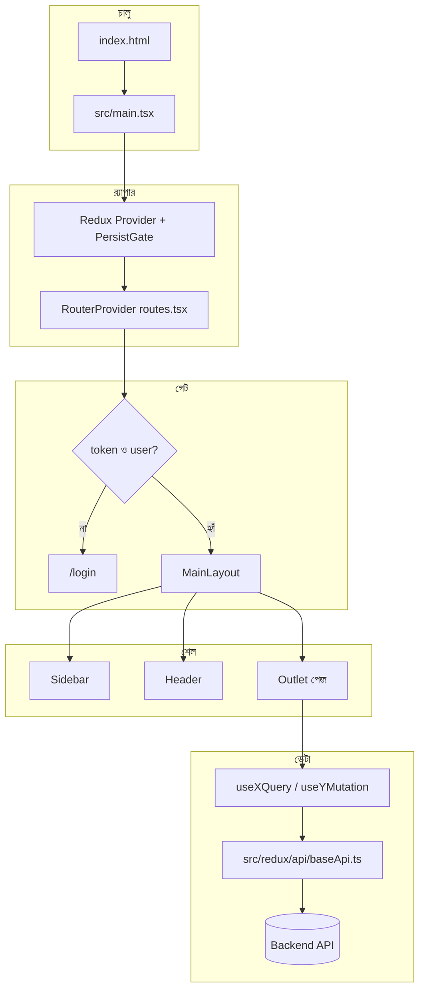
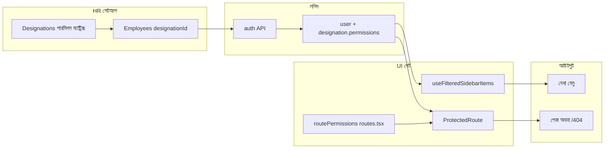
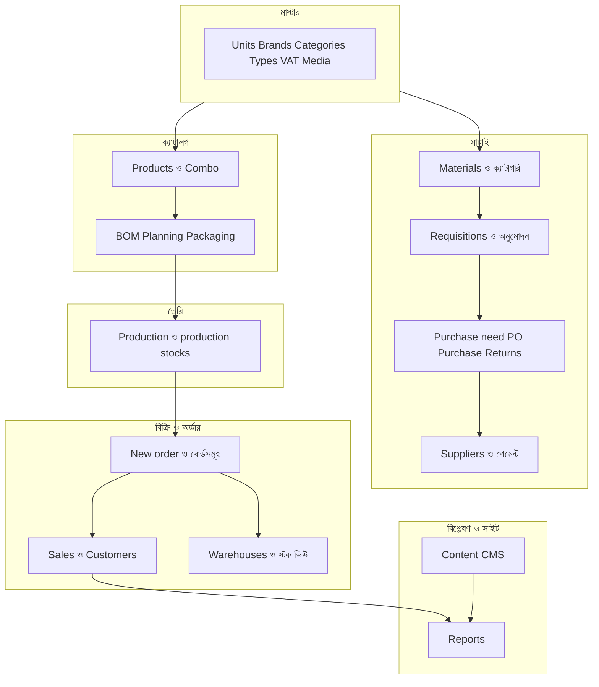

# Amzad Food Admin — পুরো প্রজেক্ট ফ্লো (ভিজুয়াল গাইড)

এই ফাইলটা **প্রথমে এখান থেকে শুরু** করলে ভালো: চোখে **ডায়াগ্রাম**, গায়ে **গল্প**, আর নিচে **কোথায় বিস্তারিত** সব লিঙ্ক। জেনেরিক বর্ণনা নয় — এই রিপোর্টের আসল ফাইল (`src/...`, `docs/...`) ধরে লেখা।

**বিস্তারিত রেফারেন্স:** [PROJECT_FLOW_AND_ARCHITECTURE_REPORT.md](./PROJECT_FLOW_AND_ARCHITECTURE_REPORT.md) (§7 রাউট ম্যাপ, §12 অপারেশনাল ফ্লো, §15 সম্পূর্ণ ইনভেন্টরি, §17 A–Z) · **CRUD + API ট্যাগ:** [REDUX_RTKQ_CRUD_FLOW.md](./REDUX_RTKQ_CRUD_FLOW.md)

---

## ৩০ সেকেন্ডে কী হয়

স্টাফ ব্রাউজারে অ্যাপ খোলে → **`main.tsx`** স্টোর ও রাউট চালু করে → **টোকেন নেই** হলে **`/login`**। **টোকেন + ইউজার** থাকলে **`MainLayout`** (বামে সাইডবার, উপরে হেডার, মাঝখানে **`Outlet`** = বর্তমান পেজ)। পেজগুলো **RTK Query** হুক দিয়ে **`baseApi`** দিয়ে ব্যাকএন্ডে JSON চায়। **সেভ/ডিলিট** হলে মিউটেশন **ট্যাগ ইনভ্যালিডেট** করে লিস্ট আবার টানে। **কে কোন মেনু/URL দেখবে** — তা **ডেজিগনেশনের পারমিশন** দিয়ে বন্ধ।

---

## ডায়াগ্রাম ১ — রানটাইম (টেকনিক্যাল ফ্লো)

চালু থেকে API পর্যন্ত এক লাইন।

**মাথায় রাখা:** UI কোড **`src/pages/...`**; HTTP এক জায়গা **`baseApi`**; রাস্তার টেবিল **`src/routes/routes.tsx`**।

---

## ডায়াগ্রাম ২ — অনুমতি (কে কী দেখে, কেন ৪০৪)

অ্যাডমিন ইউজারের **ডেজিগনেশন** = মডিউল + অ্যাকশন (`view`, `create`, …)। মেনু **সাইডবার ফিল্টার**; URL **ProtectedRoute + routePermissions** — দুটোর মডিউল নাম **মিলতে হবে** ব্যাকএন্ডের সাথে।

**প্রায়শই সমস্যা:** `/orders/:id` খুললে ৪০৪ — অনেক সময় **`Orders` বনাম `Completed Orders`** পারমিশন মিলছে না। ডিবাগ: **`/permission-debug`**।

---

## ডায়াগ্রাম ৩ — বিজনেস পাইপলাইন (কী আগে, কী পরে)

এটা “আদর্শ গল্প” — আপনার অপারেশনে কিছু ধাপ এড়িয়ে যেতে পারে, তবু **সিস্টেমের যুক্তি** বোঝার জন্য।

**সংক্ষেপ বাক্য:** মাস্টার ও মাল → ক্রয় চেইন → প্রোডাক্ট+BOM+প্ল্যান → প্রোডাকশন → অর্ডার ফুলফিল → বিক্রয়/গুদাম → রিপোর্ট; পাশাপাশি গ্রাহক সাইটের কনটেন্ট CMS।

---

## এক নজরে টেবিল — কোথায় কী (মূল রাউট + কোড)

| এলাকা | মূল রাউট (উদাহরণ) | পেজ ফোল্ডার (মূলত) | API / নোট |
|--------|-------------------|-------------------|------------|
| ড্যাশবোর্ড | `/` | `src/pages/Dashboard/` | `userApi`, `customersApi` + চার্ট |
| ইউজার ও অ্যাক্সেস | `/designations`, `/employees` | `Designation/`, `Employees/` | `designationsApi`, `employeesApi` |
| অর্ডার | `/orders/create`, `/orders/complete`, `/orders/:id`, … | `src/pages/OrderManagement/` | `order/orderApi.ts` |
| প্রোডাক্ট | `/products`, `/create-product`, `/product/:id`, … | `src/pages/Product/` | `product/productApi.ts` |
| কম্বো | `/combo-products`, `/combo-product/:id/packaging-bom`, … | `src/pages/ComboProduct/` | `comboProduct/comboProductApi.ts` |
| মেটেরিয়াল | `/materials`, `/requisitions`, `/categories` | `Materials/`, `RequisitionList/`, `Category/` | `material/materialApi.ts`, `requisition*.ts` |
| ক্রয় | `/purchase-need`, `/purchases`, `/purchase-returns`, `/suppliers` | `PurchaseManagement/`, `Supplier/` | `purchases-management/...`, `suppliersApi.ts` |
| প্রোডাকশন | `/productions`, `/production-stocks` | `src/pages/Production/` | `production/productionApi.ts` |
| বিক্রয় | `/sales`, `/customer` | `SalesManagement/`, `Customers/` | `salesApi`, `customersApi` |
| গুদাম | `/warehouses`, `/warehouses/:id` | `src/pages/warehouse/` | `warehousesApi.ts` |
| রিপোর্ট | `/reports/*` | `src/pages/Reports/**` | **`report/reportApi.ts`** (বড়) |
| কনটেন্ট CMS | `/home`, `/about-us`, policies, `/hot-deals` | `DynamicSectionAndContent/**` | `homeApi`, `dynamicContentApi`, `policyApi`, … |
| সেটিংস | `/coupons`, `/delivery-charge`, `/vat-settings`, … | ছড়িয়ে `pages/` ও ডাইনামিক | `coupon`, `deliveryCharge`, `vat`, … |

সম্পূর্ণ রাউট লিস্ট: মূল রিপোর্ট **§15.1**।

---

## আলাদা আচরণ (বোঝার জন্য)

- **`/quick-view/:type/:id`** — `MainLayout` ছাড়া; হালকা প্রিভিউ।
- **`*` চাইল্ড রাউট** — মিল না থাকলে **`UnderDevelopment`** (রিপোর্ট §15)।
- **লগআউট** — `Sidebar` থেকে Redux clear + `localStorage` টোকেন মুছে **`/login`**।

---

## পরের ধাপ পড়তে

1. **সব রাউট এক টেবিলে:** [PROJECT_FLOW_AND_ARCHITECTURE_REPORT.md §15](./PROJECT_FLOW_AND_ARCHITECTURE_REPORT.md)  
2. **প্রতিটা ডোমেইন গল্প:** একই ফাইল **§12**  
3. **A–Z এক পাস:** একই ফাইল **§17**  
4. **POST/PATCH/DELETE + ট্যাগ:** [REDUX_RTKQ_CRUD_FLOW.md](./REDUX_RTKQ_CRUD_FLOW.md)  
5. **পারমিশন নিয়ম:** [PERMISSION_SYSTEM.md](./PERMISSION_SYSTEM.md)

---

*এই গাইডটা “কেমনে কী হচ্ছে” চোখে ধরানোর জন্য। API এর পাথ পরিবর্তন হলে `src/redux/features/**/*Api.ts` ও ব্যাকএন্ড ডক আপডেট করতে হবে।*
